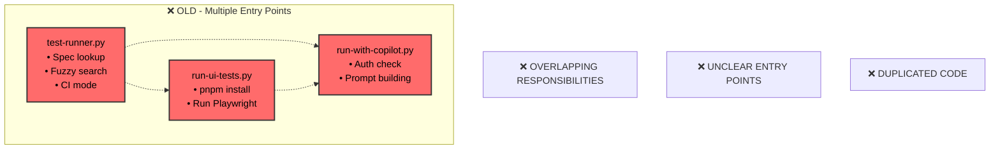
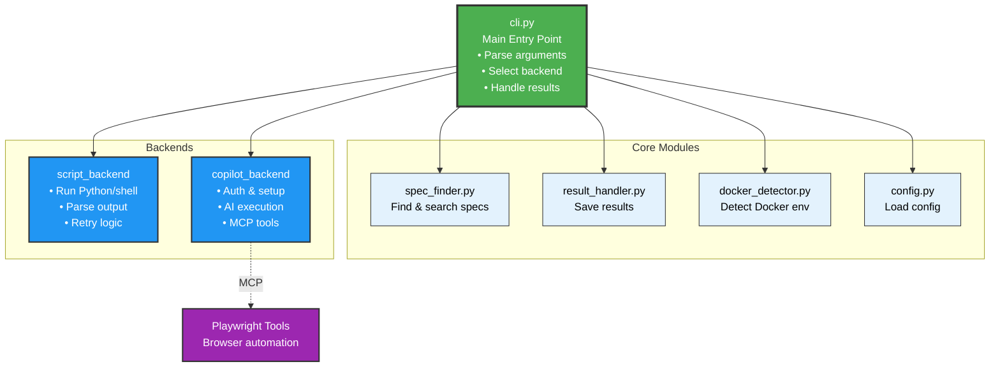

# Test Runner Architecture

## Legacy Architecture (Deprecated)



## Current Architecture (Implemented)



## Component Responsibilities

### cli.py (Main Entry Point)
- **Purpose**: Single unified interface for all test execution
- **Responsibilities**:
  - Parse command-line arguments
  - Load configuration
  - Select appropriate backend
  - Coordinate test execution
  - Handle results and reporting
- **Dependencies**: All core modules, all backends

### Core Modules

#### spec_finder.py
- Find specs by ID (e.g., `UI-001`)
- Fuzzy search by title/keywords
- List available specs
- Parse spec metadata

#### result_handler.py
- Save test results to JSON
- Generate reports (text, JSON, markdown)
- CI integration (GitHub Actions summaries)
- Result validation

#### docker_detector.py
- Detect Docker environment
- Find Crawlab containers
- Get API URLs
- Container health checks

#### config.py
- Load ci.env configuration
- Environment variable handling
- Timeout and retry settings
- Category-specific config

### Backends

#### script_backend.py
- Execute Python/Shell test scripts
- Retry logic
- Output capture and parsing
- Return code handling

#### copilot_backend.py
- GitHub authentication check
- Build Copilot prompts
- Execute via Copilot CLI
- Validate test execution
- Parse structured results

#### playwright_backend.py
- Check Node.js/pnpm
- Install dependencies
- Install Playwright browsers
- Execute TypeScript tests
- Parse Playwright JSON results

## Data Flow

```
User Command
    │
    ▼
┌───────────────────────────────────────────────┐
│  cli.py: Parse arguments                      │
│  --spec UI-001 --backend auto                 │
└───────────────────┬───────────────────────────┘
                    │
                    ▼
┌───────────────────────────────────────────────┐
│  core/spec_finder.py: Find spec               │
│  UI-001 → specs/ui/UI-001-....md              │
└───────────────────┬───────────────────────────┘
                    │
                    ▼
┌───────────────────────────────────────────────┐
│  core/config.py: Load configuration           │
│  Load ci.env, env vars, timeouts              │
└───────────────────┬───────────────────────────┘
                    │
                    ▼
┌───────────────────────────────────────────────┐
│  cli.py: Select backend                       │
│  auto → script (runner found)                 │
└───────────────────┬───────────────────────────┘
                    │
                    ▼
┌───────────────────────────────────────────────┐
│  backends/script_backend.py                   │
│  • Check prerequisites                        │
│  • Execute runner script                      │
│  • Capture output                             │
│  • Return result dict                         │
└───────────────────┬───────────────────────────┘
                    │
                    ▼
┌───────────────────────────────────────────────┐
│  core/result_handler.py                       │
│  • Save to results/result_TIMESTAMP.json      │
│  • Generate summary                           │
│  • GitHub Actions output (if CI)              │
└───────────────────┬───────────────────────────┘
                    │
                    ▼
                Exit Code
            (0=success, 1=fail)
```

## Backend Selection Logic

```python
def select_backend(spec_path: Path, backend_arg: str) -> TestBackend:
    """Select appropriate backend for test execution"""
    
    if backend_arg != "auto":
        # User explicitly specified backend
        return get_backend(backend_arg)
    
    # Auto-detect based on spec and environment
    
    # 1. Check for category-specific runner
    category = get_category(spec_path)
    runner_script = find_runner_script(category, spec_path)
    
    if runner_script:
        return ScriptBackend()
    
    # 2. Check for UI/Playwright specs
    if category == "ui" and playwright_available():
        return PlaywrightBackend()
    
    # 3. Check for helper scripts (legacy)
    helper_script = find_helper_script(category, spec_path)
    
    if helper_script:
        return ScriptBackend()
    
    # 4. Default to Copilot for unimplemented tests
    if copilot_available():
        return CopilotBackend()
    
    # 5. Fail if no backend available
    raise NoBackendAvailableError(
        "No suitable backend found for this test. "
        "Consider adding a runner script or using --backend copilot"
    )
```

## Migration Path

### Phase 1: No Breaking Changes
```bash
# Old way still works (uses wrapper)
./test-runner.py --spec UI-001

# New way available
./cli.py --spec UI-001
```

### Phase 2: Deprecation Notices
```bash
# Old way shows deprecation warning
./test-runner.py --spec UI-001
# Warning: test-runner.py is deprecated, use cli.py instead

# New way is recommended
./cli.py --spec UI-001
```

### Phase 3: Symlinks (Optional)
```bash
# test-runner.py → cli.py (symlink)
./test-runner.py --spec UI-001
# Transparently uses cli.py
```

## Benefits Summary

| Aspect | Before | After |
|--------|--------|-------|
| **Entry points** | 3 separate scripts | 1 main CLI + 3 wrappers |
| **Code duplication** | High (3 scripts) | Low (shared core) |
| **Maintainability** | Hard (scattered) | Easy (modular) |
| **Testability** | Difficult | Easy (unit test each module) |
| **User clarity** | Confusing | Clear (`cli.py` is main) |
| **Extensibility** | Hard (modify scripts) | Easy (add backend) |
| **Backward compat** | N/A | Maintained via wrappers |

## Future Enhancements

Once the refactoring is complete, these enhancements become easier:

1. **New backends**: Add Go test backend, REST API backend, etc.
2. **Parallel execution**: Run multiple tests concurrently
3. **Test queuing**: Queue tests in CI environment
4. **Better reporting**: HTML reports, test trends, dashboards
5. **Plugin system**: User-defined backends
6. **Remote execution**: Run tests on remote workers
7. **Test orchestration**: Complex test workflows

## Conclusion

The refactoring transforms the test infrastructure from a collection of scripts into a well-architected system with clear responsibilities and modular design. This follows the **Occam's Razor** principle by simplifying the architecture while maintaining all functionality.
