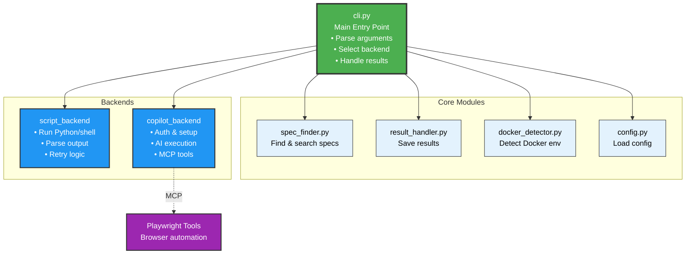
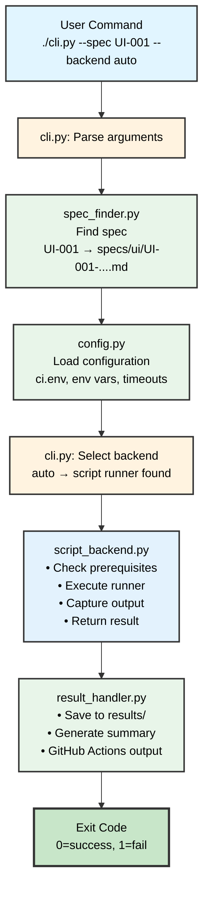
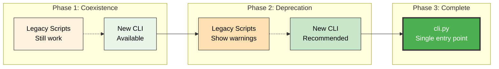

# Test Runner Architecture

## Architecture Overview



## Component Responsibilities

### cli.py (Main Entry Point)
- **Purpose**: Single unified interface for all test execution
- **Responsibilities**:
  - Parse command-line arguments
  - Load configuration
  - Select appropriate backend
  - Coordinate test execution
  - Handle results and reporting
- **Dependencies**: All core modules, all backends

### Core Modules

#### spec_finder.py
- Find specs by ID (e.g., `UI-001`)
- Fuzzy search by title/keywords
- List available specs
- Parse spec metadata

#### result_handler.py
- Save test results to JSON
- Generate reports (text, JSON, markdown)
- CI integration (GitHub Actions summaries)
- Result validation

#### docker_detector.py
- Detect Docker environment
- Find Crawlab containers
- Get API URLs
- Container health checks

#### config.py
- Load ci.env configuration
- Environment variable handling
- Timeout and retry settings
- Category-specific config

### Backends

#### script_backend.py
- Execute Python/Shell test scripts
- Retry logic
- Output capture and parsing
- Return code handling

#### copilot_backend.py
- GitHub authentication check
- Build Copilot prompts
- Execute via Copilot CLI
- Validate test execution
- Parse structured results

#### playwright_backend.py
- Check Node.js/pnpm
- Install dependencies
- Install Playwright browsers
- Execute TypeScript tests
- Parse Playwright JSON results

## Data Flow



## Backend Selection Logic

```python
def select_backend(spec_path: Path, backend_arg: str) -> TestBackend:
    """Select appropriate backend for test execution"""
    
    if backend_arg != "auto":
        # User explicitly specified backend
        return get_backend(backend_arg)
    
    # Auto-detect based on spec and environment
    
    # 1. Check for category-specific runner
    category = get_category(spec_path)
    runner_script = find_runner_script(category, spec_path)
    
    if runner_script:
        return ScriptBackend()
    
    # 2. Check for UI/Playwright specs
    if category == "ui" and playwright_available():
        return PlaywrightBackend()
    
    # 3. Check for helper scripts (legacy)
    helper_script = find_helper_script(category, spec_path)
    
    if helper_script:
        return ScriptBackend()
    
    # 4. Default to Copilot for unimplemented tests
    if copilot_available():
        return CopilotBackend()
    
    # 5. Fail if no backend available
    raise NoBackendAvailableError(
        "No suitable backend found for this test. "
        "Consider adding a runner script or using --backend copilot"
    )
```

## Migration Path



## Benefits Summary

| Aspect | Before | After |
|--------|--------|-------|
| **Entry points** | 3 separate scripts | 1 main CLI + 3 wrappers |
| **Code duplication** | High (3 scripts) | Low (shared core) |
| **Maintainability** | Hard (scattered) | Easy (modular) |
| **Testability** | Difficult | Easy (unit test each module) |
| **User clarity** | Confusing | Clear (`cli.py` is main) |
| **Extensibility** | Hard (modify scripts) | Easy (add backend) |
| **Backward compat** | N/A | Maintained via wrappers |

## Future Enhancements

Once the refactoring is complete, these enhancements become easier:

1. **New backends**: Add Go test backend, REST API backend, etc.
2. **Parallel execution**: Run multiple tests concurrently
3. **Test queuing**: Queue tests in CI environment
4. **Better reporting**: HTML reports, test trends, dashboards
5. **Plugin system**: User-defined backends
6. **Remote execution**: Run tests on remote workers
7. **Test orchestration**: Complex test workflows

## Conclusion

The refactoring transforms the test infrastructure from a collection of scripts into a well-architected system with clear responsibilities and modular design. This follows the **Occam's Razor** principle by simplifying the architecture while maintaining all functionality.


## Execution Details & Reporting

The Copilot backend now captures comprehensive execution details including step-by-step results, issues, logs, and error information. This data is automatically parsed and displayed in GitHub Actions summaries for better visibility and debugging.

## Features

### 1. Step Execution Tracking

The system automatically detects and parses step execution from Copilot output:

- **Pattern Recognition**: Detects common step indicators like "Step 1:", "✓ Step", "✗ Step"
- **Status Tracking**: Identifies passed (✅), failed (❌), and skipped (⚠️) steps
- **Display**: Shows up to 20 steps in GitHub Actions summary

### 2. Issue Detection

Automatically captures errors, warnings, and exceptions:

- **Error Patterns**: Detects "Error:", "Exception:", "Failed:", "Warning:"
- **Context**: Captures the full error message
- **Display**: Shows first 10 issues in GitHub Actions summary

### 3. Log Extraction

Captures execution logs for debugging:

- **Format Recognition**: Detects timestamped logs and standard log levels (INFO, DEBUG, ERROR)
- **Truncation**: Keeps first 50 and last 50 entries if logs exceed 100 lines
- **Display**: Collapsible section in GitHub Actions summary

### 4. Raw Output Capture

Preserves complete stdout and stderr:

- **Full Capture**: All console output is saved
- **Truncation**: Automatically truncates very long output (>10KB for stdout, >5KB for stderr)
- **Display**: Collapsible sections in GitHub Actions summary

## GitHub Actions Summary Format

When tests run in CI, the summary includes:

```markdown
# ✅ Test Execution: PASSED

## Test Information
| Attribute | Value |
|-----------|-------|
| **Specification** | `specs/ui/UI-001-...` |
| **Status** | ✅ **PASSED** |
| **Exit Code** | `0` |
| **Timestamp** | 2025-10-10 14:30:00 UTC |

## 📊 Test Execution Summary
| Metric | Value |
|--------|-------|
| **Total Steps** | 6 |
| **Completed** | ✅ 6 |
| **Failed** | ❌ 0 |
| **Backend** | `copilot` |

## 📝 Step Execution Details
1. ✅ Step 1: Login to Crawlab
2. ✅ Step 2: Navigate to Spiders Page
3. ✅ Step 3: Verify Spider List
4. ✅ Step 4: Create New Spider
5. ✅ Step 5: Verify Spider in List
6. ✅ Step 6: Delete Test Spider

## 📋 Execution Logs
<details>
<summary>Click to expand logs</summary>
...
</details>

## 📋 Raw Output (stdout)
<details>
<summary>Click to expand stdout</summary>
...
</details>
```

## Enhanced Test Reporting

### For Copilot-Executed Tests

When Copilot executes tests, it should use the enhanced reporting tool:

```bash
./tests/tools/report_test_result.py \
  --status passed \
  --total-steps 6 \
  --completed-steps 6 \
  --duration "3m 45s" \
  --step-details '[
    {"step": 1, "name": "Login", "status": "passed"},
    {"step": 2, "name": "Navigate", "status": "passed"},
    {"step": 3, "name": "Create Spider", "status": "passed"}
  ]' \
  --issues '[]'
```

### For Failed Tests

```bash
./tests/tools/report_test_result.py \
  --status failed \
  --total-steps 6 \
  --completed-steps 3 \
  --failed-steps 1 \
  --reason "Step 4: Spider creation failed - form validation error" \
  --issues '[
    {"type": "error", "message": "Required field missing: spider name", "step": 4},
    {"type": "validation", "message": "Form validation failed", "step": 4}
  ]'
```

## Parsing Details

### Step Recognition Patterns

The system looks for:
- `Step N:` - Standard numbered steps
- `✓ Step N:` or `✗ Step N:` - Steps with status indicators
- `N) Action... passed/failed` - Alternative numbering

### Error/Issue Patterns

- `Error: <message>`
- `Exception: <message>`
- `Failed: <message>`
- `Warning: <message>`

### Log Patterns

- Lines with timestamps: `2025-10-10 14:30:00`
- Lines with log levels: `INFO`, `DEBUG`, `WARNING`, `ERROR`

## Benefits

1. **Better Visibility**: See exactly what happened during test execution
2. **Faster Debugging**: Quickly identify which step failed and why
3. **Historical Record**: All execution details saved in result JSON files
4. **CI Integration**: Rich summaries in GitHub Actions without digging through logs
5. **Pattern Analysis**: Automated parsing means consistent data structure

## Configuration

No configuration needed! The parsing happens automatically in the Copilot backend.

To adjust parsing behavior, edit:
- `/tests/backends/copilot_backend.py` - `_parse_execution_details()` method

## Example Output

See `/tests/results/` directory for example JSON result files with execution details.

## Future Enhancements

Potential improvements:
- Screenshot/artifact capture
- Performance metrics (step duration)
- Test coverage reporting
- Flakiness detection
- Automatic retry with detailed comparison
